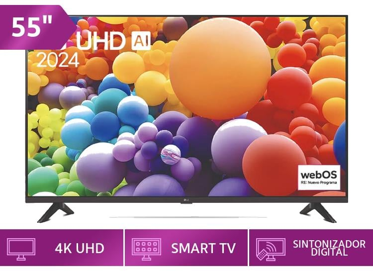

# TecnoPeru - Smart TV 4K UHD Premium



## 📋 Descripción

TecnoPeru es una landing page enfocada en la promoción y venta de un Smart TV 4K UHD Premium de 55". El sitio web presenta de manera atractiva las características y beneficios del producto, testimonios de clientes, preguntas frecuentes y un formulario de contacto para potenciales compradores.

🔗 **Demo del sitio:** ((https://xeditoxfyslsdhqirdmrza.on.drv.tw/producto_digital/#caracteristicas))

## ✨ Características principales

- Diseño responsivo adaptado a dispositivos móviles y escritorio
- Secciones interactivas con modalidad de compra
- Galerías de imágenes del producto
- Sistema de preguntas frecuentes con acordeones
- Testimonios de clientes
- Formulario de contacto
- Proceso de compra simplificado con múltiples opciones de pago

## 🛠️ Tecnologías utilizadas

- HTML5
- CSS3 (con animaciones personalizadas)
- JavaScript (Vanilla)
- Diseño responsivo (Mobile First)

## 📂 Estructura del proyecto

```
tecnoperu/
│
├── index.html
├── README.md
│
├── css/
│   ├── index.css         # Estilos principales
│   └── animations.css    # Animaciones personalizadas
│
├── js/
│   └── script.js        # Funcionalidades interactivas
│
└── img/
    ├── televisor.png    # Imagen principal del producto
    ├── tele.png         # Imagen detallada del producto
    ├── persona1.png     # Imagen testimonial
    ├── persona2.png     # Imagen testimonial
    ├── persona3.png     # Imagen testimonial
    └── logo.png         # Logo de TecnoPeru
```

## 📱 Características responsivas

El sitio está completamente optimizado para diferentes tamaños de pantalla:
- Móviles (hasta 480px)
- Tablets (481px - 768px)
- Laptops (769px - 1024px)
- Escritorio (1025px en adelante)

## 🔍 Secciones principales

1. **Hero**: Presentación principal del producto con llamado a la acción
2. **Beneficios**: Ventajas clave del Smart TV
3. **Características**: Especificaciones técnicas detalladas
4. **Testimonios**: Opiniones de clientes que han adquirido el producto
5. **FAQ**: Preguntas frecuentes organizadas por categorías
6. **Contacto**: Formulario y opciones para comunicarse con la empresa

## 🔄 Funcionalidades interactivas

- Modal de detalles del producto con especificaciones completas
- Modal de compra con diferentes opciones de pago
- Acordeones en la sección FAQ
- Formulario de contacto funcional
- Navegación suave entre secciones

## 👥 Colaboradores

Este proyecto fue desarrollado por:

- Sebastian Joel Villegas
- Noel Ayala Camarena

## 📝 Licencia

Copyright © 2025 TecnoPeru. Todos los derechos reservados.
